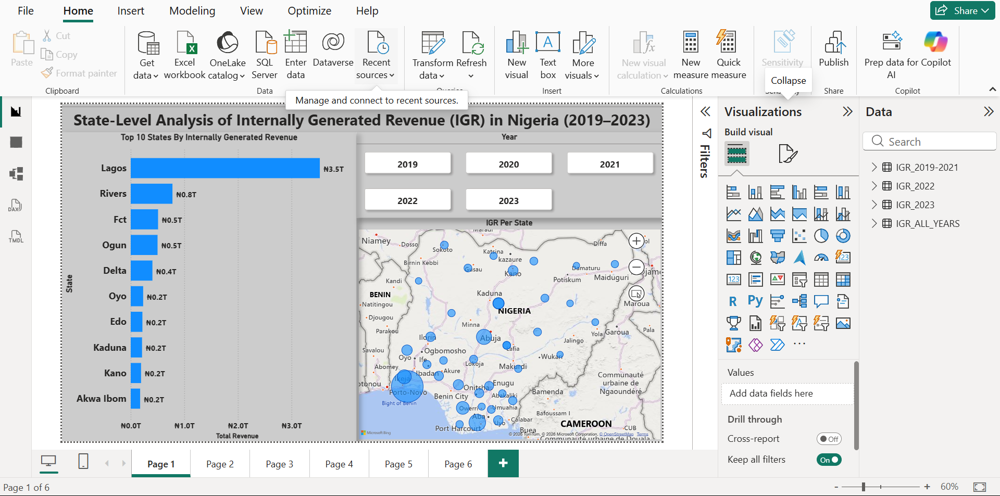

# State-Level Analysis of Internally Generated Revenue (IGR) in Nigeria (2019–2023)

*Interactive Power BI dashboard showing state-level IGR distribution with year-based filtering.*

## Project overview
This project analyzes Internally Generated Revenue (IGR) across the 36 states of Nigeria from 2019 to 2023.
The objective is to understand revenue distribution, identify top performing states, and analyze revenue trends over time using interactive Power BI visualizations.

## Problem Statement
Internally Generated Revenue (IGR) is a critical source of funding for Nigerian states. However, revenue generation varies significantly across states and over time, leading to unequal fiscal capacity and development outcomes.

This project addresses the following:
- How is IGR distributed across Nigerian states?
- Which states generate the highest revenue?
- How has state level IGR changed between 2019 and 2023?
- Are there observable geographic or performance patterns?

  ## Objectives
  - Evaluate the distribution of IGR across Nigerian states
  - Rank and compare the Top 10 revenue generating states
  - Analyze year on year revenue trends from 2019 to 2023
  - Build an interactive Power BI dashboard for insight exploration
 
    ## Data Discription
    - Source:State level Internally Generated Revenue (IGR) data
    - Format:Excel workbook (multiple sheets by year)
    - Gradularity:State level, annual revenue figures
    - Coverage:36 Nigerian states
    - Time Period:2019–2023
   
      ## Tools
      - power BI-data modeling and visualization
      - Power Query-data cleaning and transformation
      - Microsoft Excel-initial data storage and review
     
        ## Data Cleaning
        The raw dataset required significant restructuring to enable analysis:
        - Unpivoted combined year columns (2019–2021) into a single Year column
        - Renamed and standardized column headers for consistency
        - Appended datasets (2019–2021, 2022, 2023) into one consolidated table
        - Removed null values and inconsistent entries
        - Ensured each state had records across all five years for accurate comparison
       
          ## Exploratory Data Analysis(EDA)
          
          Eda focused on:
          - Understanding IGR distribution across states
          - Identifying revenue concentration among top performing states
          - Comparing year over year revenue performance
          - Observing geographic patterns in revenue generation
         
            ## Virtualizations
            The power BI dashboard includes:
            - Map:Geographic distribution of IGR across Nigerian states
            - Column Chart:Top 10 states by total IGR
            - Year Slicer:Top 10 states by total IGR
           All visuals are fully interactive and respond to slicer selections.

              ## Key Findings
              - IGR is highly concentrated in a small number of economically active states
              - Significant disparities exist between high and low performing states
              - Some states demonstrate consistent revenue performance across multiple years
              - Geographic location appears to influence revenue generation patterns
             
                ## Limitations
                - Population size and inflation effects were not accounted for
                - Analysis is based solely on reported IGR figures
                - External economic, political, and policy factors were not included
               
                  ## Conclusion
                  This project demonstrates the use of Power BI to clean, model, and analyze multi-year financial data for actionable insights. By examining Internally Generated Revenue (IGR) across Nigerian states from 2019 to 2023, the analysis highlights revenue disparities, top performing states, and temporal trends that can support fiscal planning and policy evaluation. The project reflects practical data analytics skills relevant to real world decision making.

                  
            
          
          
          

